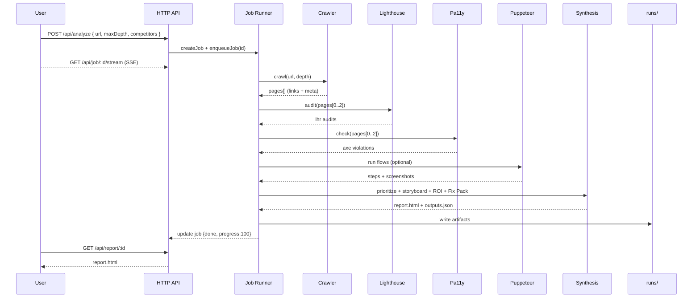

# Agentic UX — Technical Design

## Overview
Agentic UX is a lightweight Node/TypeScript service that analyzes a website and synthesizes an executive storyboard with prioritized fixes. It composes small adapters (crawler, Lighthouse, Pa11y, Puppeteer) behind a simple job runner, then renders a static HTML report and JSON/CSV exports under `runs/`.

- Server: minimal HTTP router (`src/index.ts`) with endpoints for jobs, reports, exports, runs, and triage.
- Job orchestration: `JobStore` (in‑memory) + `enqueueJob` pipeline (`crawl → perf → a11y → bench → journeys → synthesis`).
- Engines: pluggable adapters in `src/agents/*` and orchestrators in `src/engines.ts`.
- Synthesis: prioritization, storyboard HTML, ROI, Fix Pack, Summary/Roadmap, PR Pack under `src/synthesis/*`, `src/fixpacks/*`, `src/prpack/*`.
- Storage: ephemeral artifacts in `runs/<jobId>/` (HTML report, JSON snapshots, journey screenshots), run meta/triage in JSON via `src/store/jsonStore.ts`.
- UI: static landing page in `public/`, report is server‑rendered HTML with light JS (SSE progress wiring and ROI controls). Technical tables/tools exist in the code but remain hidden in the business report.

## Architecture
See `architecture.mmd` for a component diagram and a request flow sequence. A preview is embedded below using Mermaid.

```mermaid
flowchart LR
  subgraph Client
    UI[Landing Page / Report Viewer]
  end

  subgraph Server[Node.js Server]
    API[/HTTP API/]
    JR[Job Runner]
    SYN[Synthesis]
  end

  subgraph Engines
    CRAWL[Crawler (HTTP)]
    PERF[Lighthouse]
    A11Y[Pa11y]
    FLOWS[Puppeteer Journeys]
  end

  subgraph Storage
    RUNS[(runs/<id>)]
    META[(run index + triage JSON)]
  end

  UI -- POST /api/analyze --> API
  API --> JR
  JR --> CRAWL --> JR
  JR --> PERF --> JR
  JR --> A11Y --> JR
  JR --> FLOWS --> JR
  JR --> SYN --> RUNS
  API <-- GET /api/report/:id --> RUNS
  API <-- GET exports (CSV/JSON/MD) --> RUNS
  API <-- GET /api/runs & diff --> META
  UI <-- SSE /api/job/:id/stream --> API
```

### Request Lifecycle (Sequence)


## Data Model (selected)
- `Job`: `{ id, url, options, status, progress, stage, outputs? }` stored in memory.
- `PageRun`: `{ url, links[], meta{title,h1,description}, lhr?, axe? }`.
- `Issue`: `{ id, type: 'perf'|'a11y'|'seo'|'flow', pageUrl?, severity, impact, effort, score, fixSteps[] }`.
- `Journey`: `{ name, steps[{ action, selector?, value?, ok, t, screenshotPath? }], failedAt? }`.

## Key Modules
 - `src/index.ts`: HTTP server, routes, SSE progress, artifact serving, wiring for exports and tools (triage, copy coach, roast mode).
   - Note: roast UI is only visible when REPORT_INCLUDE_TECH=true.
- `src/jobs/jobStore.ts`: in‑memory job registry with timestamps.
- `src/jobs/jobRunner.ts`: orchestrates crawl → audits → bench → journeys → synthesis → writes outputs.
- `src/engines.ts`: resolves and calls adapters with graceful fallbacks when dependencies are missing.
- `src/agents/*`: `crawl.http.ts`, `perf.lighthouse.ts`, `a11y.pa11y.ts`, `journeys.puppeteer.ts`.
- `src/synthesis/*`: prioritization, storyboard HTML, ROI, summary/roadmap, digest for diffs.
- `src/fixpacks/*` and `src/prpack/*`: action plan and draft code changes.
- `src/store/jsonStore.ts`: run index, diffs, triage state and metadata.

## Endpoints (high‑level)
- Analyze: `POST /api/analyze` → `{ jobId }`.
- Jobs: `GET /api/job/:id`, `GET /api/job/:id/stream`.
- Report: `GET /api/report/:id` + static artifact serving under `/runs/*`.
- Exports: issues JSON/CSV, Fix Pack JSON/MD, PR Pack JSON/MD/patch, ROI JSON/MD, Summary JSON/MD, Roadmap JSON, Jira CSV.
- Runs & diffs: `GET /api/runs`, `GET /api/run/:id`, `GET /api/diff/:a/:b`, `GET /project`.
- Triage: `POST /api/triage`, `GET /api/triage`, `POST /api/triage/meta`, `GET /api/triage/meta`.
- Tools: journeys suggest/run, roast, copy coach, LLM diagnostics.

## Operational Model
- Deploy: Dockerfile (Chromium base), Compose with Cloudflare Tunnel; or systemd on a VM.
- Observability: console logs; artifacts in `runs/` (HTML, JSON, screenshots, logs) for forensic review.
- Configuration: `.env` for ports and Chrome paths; optional LLM key; flows via `FLOWS_PATH`.

## Performance & Scale
- Concurrency: single‑process in‑memory queue; work runs serially per job.
- Scale path: externalize queue (e.g., Redis) and persistence (SQLite/Postgres), run multiple workers behind a load balancer; persist runs and triage for cross‑instance access; gate heavy engines with rate limits.
- Time targets: 1–3 minutes for a typical scan (depth ≤ 2, ≤ 3 audited pages).

## Security & Privacy
- No credentials required; optional GEMINI_API_KEY used only server‑side.
- CORS is open for convenience in prototype; lock down for shared deployments.
- Artifacts are local; avoid scanning sensitive/non‑public sites without permission.

## Risks & Mitigations
- Browser dependency failures: detect Chrome paths; degrade gracefully by skipping perf/journeys.
- Anti‑bot responses: extend crawler with stronger headers and retry/backoff; add allow‑list.
- Report compatibility drift: post‑process injected wiring to keep interactive buttons working across versions.

## Future Enhancements
- Richer UI app for progress and run management.
- PDF export with print‑friendly CSS and CLI hook.
- First‑class DB (SQLite/Postgres) and auth model.
- More engines (Core Web Vitals field data, contrast checks, link health, forms a11y).
